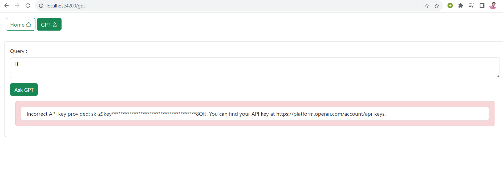

# Narrative Nexus - OpenAI API Integration with Angular


## Overview

This Angular application, "narrative-nexus," is designed to demonstrate the integration of the OpenAI API. It allows users to input queries, which are then sent to the OpenAI server using an API key for authentication. The responses from the OpenAI API are rendered seamlessly on the user interface.

## Features

- Query OpenAI API with user-provided input.
- Display responses from the OpenAI API in a user-friendly format.
- Secure authentication using an API key.

## Project Overview

1. Get your API key here


2. Your API Key should be valid and active


3. Home Page


4. Hi Assistant Response


5. Open AI query Response


6. Invalid API key Response



7. Quota Expired Response


8. Network Response


## Prerequisites

Before you begin, ensure you have met the following requirements:

- [Node.js](https://nodejs.org/) and [npm](https://www.npmjs.com/) installed.
- An OpenAI API key. You can obtain one by signing up on the [OpenAI platform](https://platform.openai.com/account/api-keys).

## Installation

1. Clone the repository:

   ```bash
   git clone https://github.com/your-username/narrative-nexus.git

2. Navigate to the project directory:

   ```bash
    cd narrative-nexus

3. Install Dependencies:

   ```bash
   npm install

4. Configure OpenAI API Key:
Add your 'apiKey' here 
src\environments\environment.ts


5. Start the Application:

   ```bash
   ng serve


The application will be accessible at http://localhost:4200.

## Usage
Access the Narrative Nexus application through your web browser.

Enter your queries or questions in the provided input field.

Click the "Submit" button to send your query to the OpenAI server.

Wait for the response, and the application will display the OpenAI-generated response on the UI.


## License
This project is licensed under the MIT License - see the LICENSE file for details.

## Acknowledgments
Special thanks to OpenAI for their powerful natural language processing capabilities.
Inspiration for this project came from Professeur Mohamed YOUSSFI.